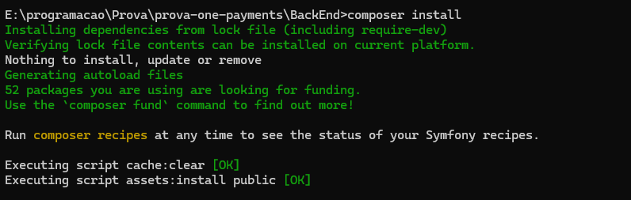
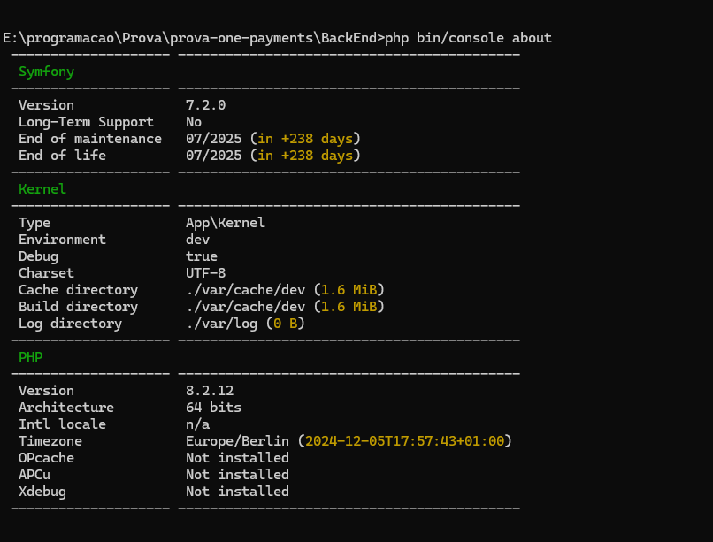
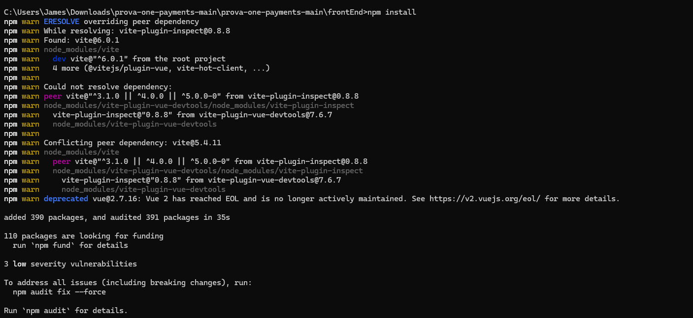

# Projeto Link de Pagamento

Este projeto foi feito para a execução de um teste técnico onde deve ser desenvolvido um **link de pagamento** que leva diretamente ao checkout, onde o usuário poderá visualizar os detalhes de um pagamento e realizar a transação e construír uma API  que simula o processamento do pagamento e armazena os dados da transação em um banco de dados.

## Pré requisitos

1. **PHP** >=(8.2.12) com composer
2. **Symfony** CLI versão 7
3. **Node.js** (>= 16.x) com npm
4. **GIT**

## Instalando PHP

### Windows

1. Baixe o PHP
   Acesse [php.net/downloads](https://www.php.net/downloads).
   Baixe a versão apropriada para o seu sistema (geralmente a versão *Thread Safe* para Windows)
2. Extraia o arquivo
   Extraia o conteúdo do arquivo ZIP baixado em uma pasta, como `C:\php`
3. Configure o PHP:
   Renomeie o arquivo `php.ini-development` para `php.ini`
   Abra o arquivo `php.ini` e configure conforme necessário. Por exemplo, ative extensões como `extension=mysqli` e `extension=gd`  apenas removendo ";" do começo de alguns deles, salve e pronto.
4. Adicione o PHP ao PATH do Windows
   Vá em **Configurações do Sistema** > **Variáveis de Ambiente** > **Editar PATH**
   Adicione o caminho da pasta onde o PHP foi extraído (por exemplo, `C:\php`)
5. Teste a instalação
   Abra o terminal (Prompt de Comando ou PowerShell)
   Digite `php -v` para verificar a versão instalada

### Linux (Ubuntu/Debian)

1. Atualize os pacotes do sistema

   ```
      sudo apt update && sudo apt upgrade
   ```
2. Instale o PHP

   ```
   sudo apt install php
   ```
3. Para uma versão específica (exemplo, PHP 8.2)

   ```
    sudo apt install php8.2
   ```
4. Verifique a instalação

   ```
   php -v
   ```
5. Instale extensões PHP adicionais
   extensão Mysql:

   ```
   sudo apt install php-mysql
   ```

   extensão gd

   ```
   sudo apt install php-gd
   ```

### Mac (usando Homebrew)

1. Instale o Homebrew (se ainda não tiver):
   Execute este comando no terminal:

   ```
   /bin/bash -c "$(curl -fsSL https://raw.githubusercontent.com/Homebrew/install/HEAD/install.sh)"
   ```
2. Atualize o Homebrew:

   ```
   brew update
   ```
3. Instale o PHP:
   Para a versão mais recente:

   ```
   brew install php
   ```

   Para uma versão específica:

   ```
   brew install php@8.2
   ```
4. Verifique a instalação:

   ```
   php -v
   ```
5. Configure o PATH (se necessário):
   Adicione o PHP ao seu PATH no arquivo ~/.zshrc ou ~/.bash_profile:

   ```
   export PATH="$(brew --prefix php)/bin:$PATH"
   ```
6. Verifique o arquivo php.ini:
   dite o arquivo de configuração do PHP (localizado em /usr/local/etc/php/<versão>/php.ini) e confirme que a linha a seguir está ativada:

   ```
   extension=gd
   ```

### Testando o PHP no Navegador

1. Instale um servidor web como Apache ou Nginx:
   **Ubuntu/Debian**: sudo apt install apache2
   **Mac**: Instale o Apache com Homebrew: brew install httpd
2. Configure o PHP com o servidor web:
   Edite o arquivo de configuração do Apache ou Nginx para suportar PHP.
   Exemplo no Apache:

   ```
   sudo apt install libapache2-mod-php
   sudo systemctl restart apache2
   ```
3. Crie um arquivo info.php no diretório do servidor

   ```
   <?php
   phpinfo();
   ?>
   ```
4. Acesse no navegador:
   Abra http://localhost/info.php para verificar se o PHP está funcionando.

## 1. Baixar e Instalar o Composer

### Windows

1. Baixe o instalador oficial:
   Acesse getcomposer.org/download e clique no link para baixar o instalador do Windows.
2. Execute o instalador:
   Siga os passos do assistente. Ele detectará automaticamente o caminho do PHP (como C:\php\php.exe).
   Se solicitado, instale o dependency manager adicional, como o OpenSSL, se necessário.
3. Adicione o Composer ao PATH:
   Durante a instalação, marque a opção para adicionar o Composer ao PATH automaticamente.
4. Teste no terminal:
   Abra o Prompt de Comando (ou PowerShell) e digite:

   ```
   composer --version   
   ```

   Você verá a versão instalada do Composer.

### Linux (Ubuntu/Debian)

1. Baixe o Composer:

   ```
   curl -sS https://getcomposer.org/installer | php
   ```
2. Mova o Composer para o PATH global:

   ```
   sudo mv composer.phar /usr/local/bin/composer
   ```
3. Teste a instalação:

   ```
    composer --version
   ```

   Se você preferir um instalador mais robusto, siga as instruções oficiais com validação de assinatura:

   ```
   php -r "copy('https://getcomposer.org/installer', 'composer-setup.php');"
   php -r "if (hash_file('sha384', 'composer-setup.php') === 'HASH_CORRETO_AQUI') { echo 'Installer verified'; } else { echo 'Installer corrupt'; unlink('composer-setup.php'); } echo PHP_EOL;"
   php composer-setup.php
   php -r "unlink('composer-setup.php');"
   sudo mv composer.phar /usr/local/bin/composer
   ```

   Substitua HASH_CORRETO_AQUI pelo hash mais recente.

### MacOS

1. Use o Homebrew (opcional):

   ```
   brew install composer
   ```
2. Ou baixe o Composer manualmente:

   ```
    curl -sS https://getcomposer.org/installer | php
    sudo mv composer.phar /usr/local/bin/composer
   ```
3. Teste a instalação:
   composer --version

## 2. Adicionar ao PATH Manualmente (se necessário)

Se o Composer não foi adicionado ao PATH automaticamente, siga as instruções abaixo:

### Windows

1. Acesse as Variáveis de Ambiente:
   Clique com o botão direito em "Este Computador" > "Propriedades".
   Vá em **Configurações Avançadas** do Sistema > "Variáveis de Ambiente"
2. Edite o PATH:
   Encontre a variável Path e edite-a.
   Adicione o diretório onde o composer.phar foi instalado, por exemplo:

   ```
    C:\Users\SeuUsuario\AppData\Roaming\Composer\vendor\bin
   ```
3. Teste no terminal:

   ```
   composer --version
   ```

### Linux/MacOS

1. Abra o arquivo de configuração do shell:
   Para Zsh: ~/.zshrc.
   Para Bash: ~/.bashrc ou ~/.bash_profile.
2. Adicione o diretório ao PATH:

   ```
   export PATH="$PATH:/usr/local/bin"
   ```
3. Atualize o terminal:

   ```
   source ~/.zshrc  # ou ~/.bashrc
   ```
4. Teste:

   ```
    composer --version
   ```

## 1. Instalar Symfony no Windows (usando Scoop)

### Passo 1: Instalar o Scoop

1. Abra o PowerShell (caso precise abra como Administrador).
2. Execute o seguinte comando para instalar o Scoop:

```
   Set-ExecutionPolicy RemoteSigned -Scope CurrentUser
   irm get.scoop.sh | iex
```

Caso precise de mais informações, acesse o site do Scoop. https://scoop.sh/

3. Verifique se o Scoop foi instalado corretamente:

```
   scoop --version
```

### Passo 2: Instalar o Symfony CLI

1. Com o Scoop instalado, use o comando abaixo para instalar o Symfony CLI:

   ```
    scoop install symfony-cli
   ```
2. Verifique a instalação:

   ```
    symfony version
   ```
3. Certifique-se de que o Symfony CLI está disponível no PATH. Reinicie o terminal se necessário.

## 2. Instalar Symfony no Linux (Ubuntu)

### Passo 1: Configurar o ambiente

1. Atualize os pacotes do sistema:

```
   sudo apt update && sudo apt upgrade -y
```

2. Instale as dependências necessárias para o Symfony:
   ```
    sudo apt install curl php-cli php-mbstring unzip git -y
   ```

### Passo 2: Instalar o Symfony CLI

1. Baixe e instale o Symfony CLI:

   ```
    curl -sS https://get.symfony.com/cli/installer | bash
   ```
2. Adicione o Symfony CLI ao PATH:

   ```
     export PATH="$HOME/.symfony/bin:$PATH"
   ```

   Para tornar isso permanente, adicione ao arquivo ~/.bashrc ou ~/.zshrc:

   ```
    echo 'export PATH="$HOME/.symfony/bin:$PATH"' >> ~/.bashrc
    source ~/.bashrc
   ```
3. Verifique se a instalação foi bem-sucedida:

   ```
   symfony version
   ```

## 3. Instalar Symfony no macOS

### Passo 1: Instalar o Homebrew

1. Abra o Terminal.
2. Instale o Homebrew, se ainda não estiver instalado:

   ```
    /bin/bash -c "$(curl -fsSL https://raw.githubusercontent.com/Homebrew/install/HEAD/install.sh)"
   ```
3. Verifique se o Homebrew foi instalado corretamente:

   ```
    brew --version
   ```

### Passo 2: Instalar o Symfony CLI

1. Use o Homebrew para instalar o Symfony CLI:

   ```
    brew install symfony-cli/tap/symfony-cli
   ```
2. Verifique a instalação:

   ```
    symfony version
   ```

### Passo 3. Verificar Requisitos

1. Para verificar se o ambiente está configurado corretamente:

   ```
    symfony check:requirements
   ```
2. Corrija qualquer dependência ausente indicada no relatório.

## 1. Instalar Node.js no Windows

### Passo 1: Baixar o Instalador

1. Acesse o site oficial do Node.js:
   https://nodejs.org
2. Baixe a versão LTS (Long Term Support), recomendada para a maioria dos usuários.

### Passo 2: Instalar Node.js

1. Execute o arquivo baixado  (ex.: node-vxx.x.x-x64.msi).
2. Durante a instalação:
   Aceite os termos e condições.
   Escolha as configurações padrão.
   Marque a opção para instalar o Node.js runtime, o npm (Node Package Manager), e o Node.js native modules.

### Passo 3: Verificar a Instalação

1. Após a instalação, abra o Prompt de Comando ou PowerShell.
2. Verifique as versões instaladas:

   ```
    node -v
    npm -v
   ```

## 2. Instalar Node.js no Linux (Ubuntu)

### Passo 1: Atualizar o Sistema

1. Atualize os pacotes do sistema:
   ```
    sudo apt update && sudo apt upgrade -y
   ```

### Passo 2: Adicionar o Repositório do Node.js

1. Use o comando abaixo para adicionar o repositório oficial do NodeSource para a versão LTS do Node.js:

   ```
    curl -fsSL https://deb.nodesource.com/setup_lts.x | sudo -E bash -
   ```
2. Instale o Node.js:

   ```
    sudo apt install -y nodejs
   ```
3. Instale o npm separado, se necessário:

   ```
    sudo apt install -y npm
   ```

### Passo 3: Verificar a Instalação

1. Confirme se o Node.js e o npm foram instalados:
   ```
    node -v
    npm -v
   ```

### Passo 4: Instalar o Gerenciador de Pacotes (Opcional)

1. Para usar múltiplas versões do Node.js, instale o nvm:

   ```
    curl -o- https://raw.githubusercontent.com/nvm-sh/nvm/v0.39.4/install.sh | bash
   ```
2. Após instalar o nvm, feche e reabra o terminal e use os comandos:

   ```
    nvm install --lts
    nvm use --lts
   ```

## 3. Instalar Node.js no macOS

### Passo 1: Usar o Homebrew

1. Certifique-se de que o Homebrew está instalado:

   ```
    brew --version
   ```
2. Se não estiver, instale-o:

   ```
    /bin/bash -c "$(curl -fsSL https://raw.githubusercontent.com/Homebrew/install/HEAD/install.sh)"
   ```
3. Instale o Node.js com o Homebrew:

   ```
    brew install node
   ```

### Passo 2: Verificar a Instalação

1. Confirme que o Node.js e o npm foram instalados:
   ```
    node -v
    npm -v
   ```

### Passo 3: Usar o NVM (Opcional)

1. Instale o nvm:

   ```
   curl -o- https://raw.githubusercontent.com/nvm-sh/nvm/v0.39.4/install.sh | bash
   ```
2. Reabra o terminal e use o nvm para instalar o Node.js:

   ```
    nvm install --lts
    nvm use --lts
   ```

### Testando a Instalação

1. Crie um arquivo JavaScript chamado app.js com o seguinte conteúdo:

   ```
    console.log("Node.js está funcionando!");
   ```
2. Execute o arquivo com Node.js:

   ```
    node app.js
   ```

Saída esperada: Node.js está funcionando!

## Instalando Git

### Windows

1. Baixar o instalador do Git:
   Acesse o site oficial do Git: git-scm.com.
   Clique no botão para baixar a versão do Git compatível com Windows.
2. Executar o instalador:
   Após o download, execute o arquivo .exe.
3. Siga as instruções da instalação:
   Escolha as opções padrão a menos que tenha preferências específicas.
   Selecione um editor de texto (recomendo o VS Code ou o padrão Vim).
4. Configurar o Git:
   Abra o terminal Git Bash ou o Prompt de Comando.
   Configure seu nome e email:

   ```
      git config --global user.name "Seu Nome"
      git config --global user.email "seuemail@example.com"
   ```
5. Verificar a instalação:
   No terminal, digite:

   ```
    git --version
   ```

### Linux

1. Atualizar os pacotes:
   Abra o terminal e execute

   ```
    sudo apt update && sudo apt upgrade -y
   ```
2. Instalar o Git:
   Para distribuições baseadas no Debian/Ubuntu:

   ```
     sudo apt install git -y
   ```

   Para Fedora:

   ```
    sudo dnf install git -y
   ```

   Para Arch Linux:

   ```
    sudo pacman -S git
   ```
3. Configurar o Git:
   Configure seu nome e email:

   ```
     git config --global user.name "Seu Nome"
     git config --global user.email "seuemail@example.com"
   ```
4. Verificar a instalação:

   ```
    git --version
   ```

### macOS

1. Usar Homebrew (recomendado):
   Certifique-se de que o Homebrew está instalado (instalar Homebrew).
   Abra o terminal e instale o Git:

   ```
    brew install git
   ```
2. Usar Xcode Command Line Tools:
   No terminal, digite:

   ```
    xcode-select --install
   ```

   Isso instalará as ferramentas de linha de comando, incluindo o Git.
3. Configurar o Git:
   Configure seu nome e email:

   ```
     git config --global user.name "Seu Nome"
     git config --global user.email "seuemail@example.com"
   ```
4. Verificar a instalação:

```
   git --version
```

## Clonando Repositorio

### 1. Obter o link do repositório

1. Acesse o repositório no GitHub (ou outra plataforma Git).
2. Clique no botão Code ou equivalente e copie o link HTTPS, SSH ou GitHub CLI.
   ```
    https://github.com/TavaoBR/prova-one-payments.git
   ```

### 2. Abrir o terminal

1. Navegue até o diretório onde deseja clonar o repositório.
2. Use comandos como:
   ```
    cd /caminho/do/diretorio
   ```

### 3. Executar o comando de clonagem

1. No terminal, digite o seguinte comando:
   ```
    git clone https://github.com/TavaoBR/prova-one-payments.git
   ```

### 4. Verificar o clone

1. Após a clonagem, um novo diretório será criado com o nome do repositório. Você pode navegar até ele com:

   ```
    cd prova-one-payments
   ```
2. Confirme que os arquivos foram copiados com:

   ```
    ls
   ```

### 5. Caso seja necessário autenticação

1. Para HTTPS: Será solicitada sua senha ou token de acesso pessoal se o repositório for privado.
2. Para SSH: Certifique-se de que sua chave SSH está configurada e vinculada à sua conta.

## Instalando Depedencias do projeto

1. Após clonar o repositório, a pasta clonada deve conter as seguintes subpastas:

  

### Back End

1. Navegue para a Pasta do BackEnd
      Abra o terminal
      Digite:
      ```
       cd BackEnd
      ```

3. Instalação das dependências com Composer
   Acesse a subpasta BackEnd e, em seguida, execute o seguinte comando:
   ```
    composer install
   ```

  

4. Verifique as Dependências do Symfony
   Certifique-se de que o Symfony está configurado corretamente:
   ```
     php bin/console about
   ```
   se Tudo estiver certo irá aparecer assim  



5. Banco de Dados
   Não se preocupe com banco de dados, ele está rodando online, não irá precisar fazer nada com relação a isso 

### Front End

1. Navegue para a Pasta do Front-End
   abra o terminal
   Digite:
   ```
     cd frontEnd
   ``` 

2. Instale as Dependências do Vue 3
   Dentro da pasta frontEnd, execute o comando para instalar todas as dependências definidas no package.json:
   ```
    npm install
   ```    
   

3. Verifique o Arquivo de Configuração do Vue
   Verifique o arquivo package.json para garantir que as dependências estão corretas e que o Vue 3 está listado. O arquivo package.json deve incluir algo como:
   ```
      {
         "dependencies": {
            "vue": "^3.0.0"
         }
      }
   ```    

## Rodando a Aplicação

Para rodar a aplicação, é necessário abrir dois terminais: um para o BackEnd e outro para o FrontEnd.

### BackEnd Symfony

1. Navegue para a Pasta do BackEnd
      Abra o terminal e execute o comando
      ```
       cd BackEnd
      ```

2. Execute o Symfony:
   No terminal, digite:
   ```
     symfony serve
   ```       
   Caso o comando seja bem-sucedido, a seguinte mensagem será exibida:
   

3. URL da API:
   A API estará disponível no seguinte endereço:
   ```
      http://127.0.0.1:8000
   ```      

Observação: Para testar os endpoints, adicione o prefixo /api à URL.


### FrontEnd Vue

1. Navegue para a Pasta do Front-End
   Abra o terminal e execute o comando:
   ```
     cd frontEnd
   ```

2. Iniciando o Servidor
   Com o terminal aberto, digite:
   ```
     npm run serve
   ```
   Esse comando compilará o código e iniciará o servidor. O acesso geralmente estará disponível em http://localhost:8080, ou conforme configurado no arquivo vue.config.js.

   exemplo:    
      


